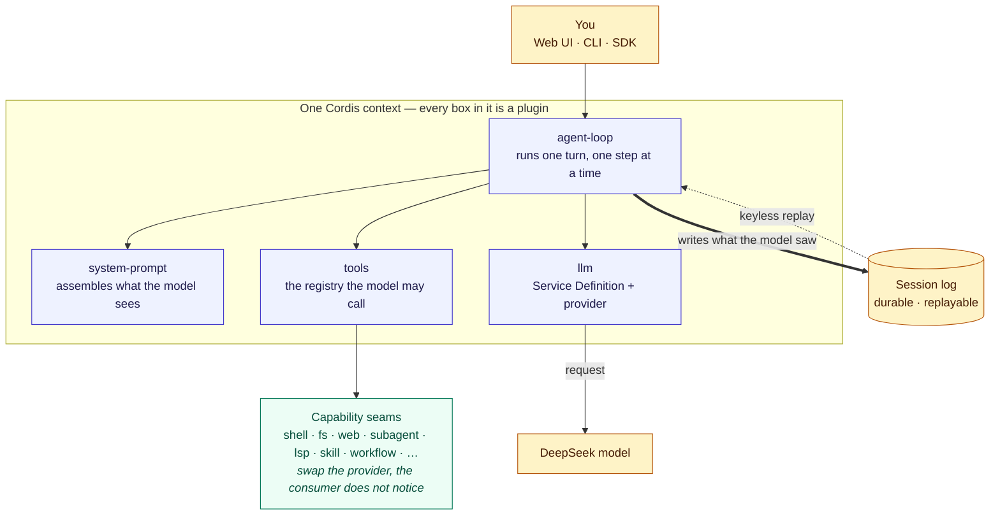

# DeepSeek Harness

English | [中文](README.zh.md)

[](https://www.typescriptlang.org/) [](https://bun.sh/) [](https://nodejs.org/) [](https://github.com/cordiverse/cordis) [](https://vitest.dev/) [](LICENSE)

DeepSeek Harness (`dsh`) is an open-source agent harness developed by [DeepSeek AI](https://deepseek.com).

It is built on an **everything-is-a-plugin** architecture and powered by [Cordis](https://github.com/cordiverse/cordis), whose design is described in [_A Programming Paradigm for Spatiotemporal Composability_](https://arxiv.org/abs/2608.25512).

Documentation: [https://deepseek-harness.github.io/deepseek-harness/](https://deepseek-harness.github.io/deepseek-harness/)

## Explain like I'm five

A harness is the thing that sits between you and a language model and actually does the work: it remembers the conversation, decides what to tell the model, gives the model tools, runs the tool the model asked for, and writes down everything that happened.

In `dsh`, every one of those jobs is a plugin. The prompt builder is a plugin. The tool registry is a plugin. Running a shell command is a plugin. Talking to the model is a plugin. Nothing is welded to the loop, so you add a capability by mounting a plugin next to the others rather than by editing the harness.

Two rules hold the whole thing together:

- **If the model can see it, it is written down.** Anything that reaches a model request can be rebuilt from the session log, which is why a session can be replayed later and why a recorded run is a test.
- **A capability arrives in three parts.** Something declares what the capability is, something provides it, and something consumes it. Swapping the provider — a different shell, a different search — changes nothing for the consumer.

## How it works



The thick arrow is the rule that makes the rest work: a turn is not finished until what the model saw is on the log, so the same run replays without a key and a recorded session is a regression test.

## This checkout

This repository is a fork of [DeepSeek Harness](https://github.com/deepseek-ai/deepseek-harness). Product identity, plugin architecture, Node runtime, community channels, and license stay with upstream.

The fork pins a different contributor toolchain:

- **bun 1.4** is the package manager and script runner (`packageManager` in `package.json`). Workspace linking uses bun's isolated linker; `dsh plugin` forwards to bun. Native addons and the single-exe build remain Node artifacts on the documented Node engines.
- **TypeScript 7** (`typescript` ^7.0.2) compiles Host and Client programs. The package exports the compiler API at `typescript/unstable/sync` and `typescript/unstable/ast`; every compiler-API consumer imports it from there, and a committed gate keeps the 6.0 Strada compatibility package out of the tree.

The fork publishes no package of its own: `npx @deepseek-ai/dsh` fetches the upstream release rather than this checkout, so the source path below is the only way to run this repository. Contributor setup, including the bun pin, is in the [development guide](docs/development.md).

A source build is not an official artifact and says so: the Web UI names itself **DeepMeow** over a cat-face mark. The [Web UI guide](docs/user/guide/index.md#local-build-identity) records where that name appears and which build profile restores the official wordmark.

## Developer preview

DeepSeek Harness is in _developer preview_ and iterating rapidly. **THERE WILL BE COMPATIBILITY-BREAKING CHANGES.**

Review the [safety notice](SAFETY.md) before running the project.

## Run

### Run from source

Install `Node.js`, then run:

```sh
git clone https://github.com/d4551/deepseek-harness.git
cd deepseek-harness
bun install
bun run build
bun run dsh web
```

`bun run build` prepares the repository artifacts. `bun run dsh web` uses those built artifacts without rebuilding.

The last command starts the Web UI at `http://127.0.0.1:3080` by default and opens it in the default browser for a local launch. An SSH launch only prints the host URL because the SSH client or editor owns the local forwarded address. Pass `--no-open` to run the server without opening a browser. See [Web UI guide](docs/user/guide/index.md).

## Community and support

- Submit feedback or bug reports through [GitHub Discussions](https://github.com/deepseek-ai/deepseek-harness/discussions).
- Add the [`dsh-plugin`](https://github.com/topics/dsh-plugin) topic to your plugin repository for discoverability.
- Join <a href="https://discord.gg/Ycq5dCaS4">DeepSeek Harness Discord community</a>.

## Contributing

See [CONTRIBUTING.md](CONTRIBUTING.md).

## Development

Start with the [development guide](docs/development.md) and [architecture documentation](docs/architecture.md).

For agents, follow [AGENTS.md](AGENTS.md).

## License

[MIT](LICENSE)

Third-party dependencies and their licenses are disclosed in [THIRD_PARTY_NOTICES.md](THIRD_PARTY_NOTICES.md).
