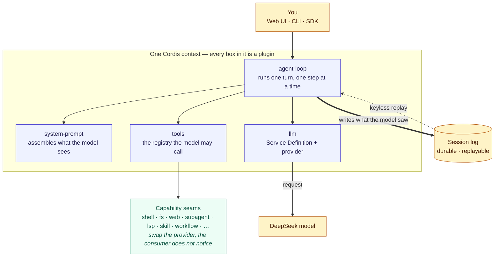

# DeepSeek Harness

[English](README.md) | 中文

[](https://www.typescriptlang.org/) [](https://bun.sh/) [](https://nodejs.org/) [](https://github.com/cordiverse/cordis) [](https://vitest.dev/) [](LICENSE)

DeepSeek Harness（`dsh`）是由 [DeepSeek AI](https://deepseek.com) 开发的开源 agent harness（智能体框架）。

它构建于**一切皆插件**的架构之上，由 [Cordis](https://github.com/cordiverse/cordis) 驱动，其设计参见论文 [_A Programming Paradigm for Spatiotemporal Composability_](https://arxiv.org/abs/2608.25512)。

文档：[https://deepseek-harness.github.io/deepseek-harness/](https://deepseek-harness.github.io/deepseek-harness/)

## 像给五岁小孩解释

harness 就是坐在你和语言模型之间、真正把活干完的那一层：它记住对话、决定告诉模型什么、把工具交给模型、执行模型点名的那个工具，并把发生过的一切都写下来。

在 `dsh` 里，上面每一项职责都是一个插件。提示词组装是插件，工具注册表是插件，执行 shell 命令是插件，与模型对话也是插件。没有任何一项焊死在循环里，所以新增一项能力靠的是在其它插件旁边挂载一个插件，而不是改动 harness 本身。

有两条规则把整套东西撑住：

- **模型能看到的，一定被写下来。** 凡是进入模型请求的内容，都能从 session 日志中重建出来；这正是一段会话日后可以重放、以及一次录制的运行可以当测试用的原因。
- **一项能力由三部分构成。** 一处声明这项能力是什么，一处提供它，一处消费它。更换提供方——换一个 shell、换一个搜索——对消费方毫无影响。

## 工作原理



那条粗箭头就是让其余部分成立的规则：一个轮次只有在模型所见都落到日志上之后才算结束，所以同一次运行无需密钥即可重放，一段录制的会话就是一条回归测试。

## 本仓库

本仓库是 [DeepSeek Harness](https://github.com/deepseek-ai/deepseek-harness) 的 fork。产品定位、插件架构、Node 运行时、社区渠道和许可证仍归上游。

本 fork 固定了不同的贡献者工具链：

- **bun 1.4** 是包管理器和脚本运行器（`package.json` 中的 `packageManager`）。workspace 链接使用 bun 的 isolated linker；`dsh plugin` 转发给 bun。原生 addon 与单文件可执行构建仍是 Node 产物，并遵循已文档化的 Node 引擎范围。
- **TypeScript 7**（`typescript` ^7.0.2）编译 Host 与 Client program。该包在 `typescript/unstable/sync` 与 `typescript/unstable/ast` 导出 compiler API；所有 compiler-API 使用方都从该包导入，且由已提交的 gate 保证 6.0 Strada 兼容包不进入本仓库。

本 fork 不发布自己的软件包：`npx @deepseek-ai/dsh` 拉取的是上游发行版而非本检出，因此下方的源码路径是运行本仓库的唯一方式。贡献者搭建步骤（含 bun 固定版本）见[开发指南](docs/development.zh.md)。

源码构建不是 official 产物，界面也据实呈现：Web UI 以 **DeepMeow** 之名搭配猫脸标记。该名称出现在哪些位置、以及哪个构建 profile 会恢复 official wordmark，记录在 [Web UI 指南](docs/user/guide/index.zh.md#local-build-identity)。

## 开发者预览

DeepSeek Harness 处于 _开发者预览_ 阶段，正在快速迭代。**未来将出现破坏兼容性的变更。**

运行本项目前，请阅读[安全说明](SAFETY.zh.md)。

<a id="run"></a>

## 运行

<a id="run-from-source"></a>

### 从源码运行

安装 `Node.js`，然后运行：

```sh
git clone https://github.com/d4551/deepseek-harness.git
cd deepseek-harness
bun install
bun run build
bun run dsh web
```

`bun run build` 会准备仓库产物。`bun run dsh web` 会直接使用这些已构建产物，不会重新构建。

最后一条命令默认会在 `http://127.0.0.1:3080` 启动 Web UI，本机启动时还会用默认浏览器打开页面。通过 SSH 启动时只打印宿主机 URL，因为本地转发地址由 SSH 客户端或编辑器持有。传入 `--no-open` 可仅运行服务器而不打开浏览器。详见 [Web UI 指南](docs/user/guide/index.zh.md)。

## 社区与支持

- 通过 [GitHub Discussions](https://github.com/deepseek-ai/deepseek-harness/discussions) 提交反馈或 bug 报告。
- 为你的插件仓库添加 [`dsh-plugin`](https://github.com/topics/dsh-plugin) 话题，便于被发现。
- 欢迎加入 DeepSeek Harness 企微群：扫码添加企微小助手并填写入群问卷，完成后小助手会邀请你入群。

<table>
  <thead>
    <tr>
      <th align="center">企微小助手</th>
      <th align="center">入群问卷</th>
      <th align="center">微信公众号</th>
    </tr>
  </thead>
  <tbody>
    <tr>
      <td align="center"></td>
      <td align="center"><a href="https://trtgsjkv6r.feishu.cn/share/base/form/shrcnIt5twSVdLGD52KJBckGCgg"></a></td>
      <td align="center"></td>
    </tr>
  </tbody>
</table>

## 参与贡献

参见 [CONTRIBUTING.md](CONTRIBUTING.zh.md)。

## 开发

请先阅读[开发指南](docs/development.zh.md)与[架构文档](docs/architecture.zh.md)。

面向 agent：请遵循 [AGENTS.md](AGENTS.md)。

## 许可证

[MIT](LICENSE)

第三方依赖及其许可证见 [THIRD_PARTY_NOTICES.md](THIRD_PARTY_NOTICES.md)。
